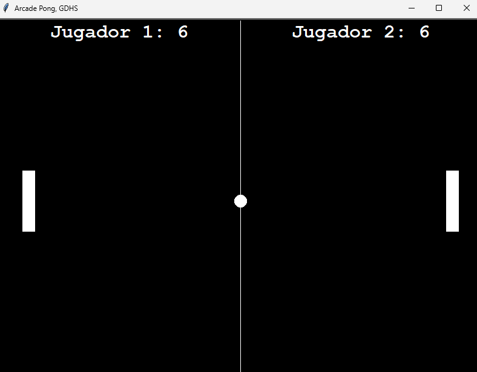

# 🕹️ Pong con Pygame

Un juego clásico de **Pong** desarrollado en **Python** utilizando la librería [Pygame](https://www.pygame.org/).  
Este proyecto forma parte de mi portafolio personal.

---

## 🚀 Instalación y ejecución

Clona este repositorio:

    git clone https://github.com/GermanHernandez2902/Arcade_Pong.git
    cd Arcade_Pong

Crea un entorno virtual (opcional pero recomendado):

    python -m venv venv
    source venv/bin/activate   # En Linux/Mac
    venv\Scripts\activate      # En Windows

Instala las dependencias:

    pip install -r requirements.txt

Ejecuta el juego:

    python Arcade_Pong.py

---

## 📸 Captura

Así luce el juego en ejecución:

---

## 📂 Estructura del proyecto

    Arcade_Pong/
    │── Arcade_Pong.py        # Código principal del juego
    │── requirements.txt      # Dependencias del proyecto
    │── pong_demo.png         # Captura del juego
    │── README.md             # Documentación

---

## 🛠️ Tecnologías utilizadas

- Python 🐍  
- Pygame 🎮  

---

## 👤 Autor

**German Hernandez**  
📌 [Mi GitHub](https://github.com/GermanHernandez2902)

